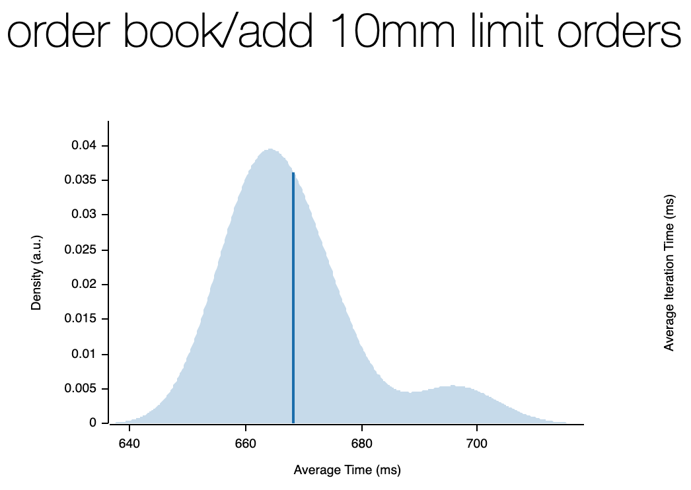

### Order Book Programming Exercise

WIP yet functional order book with support for adding, cancelling, and matching limit and market orders.

As per exercise requirements, one can pipe the "input.csv" file into stdin.
Please note that matching is enabled by a boolean. The `main` file enables it after the first scenarios in the CSV have run to pass tests. The first scenarios gets rejected when they cross and later they match/trade.

#### Setup

##### Docker

```
$ docker build -t orderbook .
$ cat input_file.csv | docker run -i orderbook
// using vimdiff to check test results (for zsh)
$ vimdiff =(cat input_file.csv |  docker run -i orderbook) output_cleaned.csv
// should be no difference
```

If you have a broken CSV the program will panic unless you pass in the flag `--ignore-errors`

```
$ cat input_file.csv | docker run -i orderbook --ignore-errors
$ cat input_file.csv | cargo run -- --ignore-errors
```

#### Tests

There is a simple integration test inside the `tests/` folder. You can run it to check the same plus a few additional scenario outputs in a hard-coded way. Please note that it uses nightly features.

```
// run only tests/ folder with watch
$ cargo +nightly watch -x "test --test '*'"
// run all incl. unit tests and nightly integration tests
cargo +nightly watch -x test
```

##### Benches

```
// benchmarking
$ cargo bench
// html report gets written to
// target/criterion/report/index.html
```

We use `criterion` for benchmarking which also gives us great html reports.
On my local machine, we see the below speeds (mb pro M1 max 64 GB memory)
)




#### Structure

The idea is that we create one order book for each symbol/ticker with the following (minimized) structure.:

```
OrderBook ->
    symbol: String
    orders: BTreeMap<order_id, Order>,
        Order -> (id, user_id, ...etc)
    bids: OrderSide,
    asks: OrderSide,
        OrderSide ->
            prices: BTreeMap<price, OrderQueue>,
            ...stats
                OrderQueue ->
                    orders: Vec<Order>,
                    ...stats
```

We store the orders both directly in the `OrderBook.orders` tree and also inside the Vector where they get pushed to the execution queue. We simply use the order_id as `key` here.
For the first draft, I went with a simple `BTreeMap`. However, I'm expecting we can gain performance by using an AVL or Red Black Tree instead for rotation.
In addition, we could store the queue index inside the map for quicker lookup in the queue too.

On the bids/asks side, we have another tree where we use `price` as the key and the queue of orders. So we can easily check the quantity/volume of each price point.

Each orderbook uses its own "producer" thread which pushes log outputs to the single consumer thread.

#### Improvements and Features

Given the limited time for this assignment and the fact that I did it as a hackathon exercise, I believe the code would be good to be refactored and tailored differently. I didn’t want to follow this during the exercise as the time was limited and I prioritized the goals first. Error handling is another area of interest that requires more sophistication.

- [ ] Refactor main code
- [ ] Add error handling
- [ ] Update logging
- [ ] Benchmark, order and price lookups, iterate and document the progress. Move towards O(1) and look into memory usage
- [ ] Add proper user_id handling, for lookup, deletes, edits
- [ ] Implement missing TimeInForce logic (IOC and FOK)
- [ ] Implement edit_order functionality
- [ ] Add more order types, e.g. Iceberg or Scale Order from Insilico https://insilicoterminal.com/
- [ ] Add more test scenarios
- [ ] Documentation tests
- [ ] Set up cicd pipeline
- [ ] Set up simple FE for live visualizations
